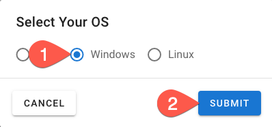

# Installing the Accurics CLI

Each operating system has a different installation method. Please follow the instructions for your environment.

## macOS

Accurics CLI installation for macOS uses the [Homebrew](http://www.brew.sh) package manager, which needs to be installed first. 

Once Homebrew is installed, you can use the `brew` command to install it:

``` Bash
> brew install accurics
==> Downloading https://downloads.accurics.com/cli/1.0.15/accurics-cli.dmg
######################################################################## 100.0%
==> Installing Cask accurics
==> Linking Binary 'accurics' to '/usr/local/bin/accurics'
🍺  accurics was successfully installed!
```

## Linux

The Accurics CLI is downloaded from the Accurics console.

1. Log into the Accurics console
2. Click the three vertical dots to open the menu for your environment

    

3. Click **Download CLI**
4. On the next screen select **Linux** and hit the **Submit** button

    

5. Once it's downloaded, you will need to mark it executable and place it in your path. It can also be invoked locally.

    ``` Bash
    > chmod +x accurics
    ```

## Windows

The Accurics CLI is downloaded from the Accurics console.

1. Log into the Accurics console
2. Click the three vertical dots to open the menu for your environment

    

3. Click **Download CLI**
4. On the next screen select **Windows** and hit the **Submit** button

    

5. Place the downloaded executable file in your path