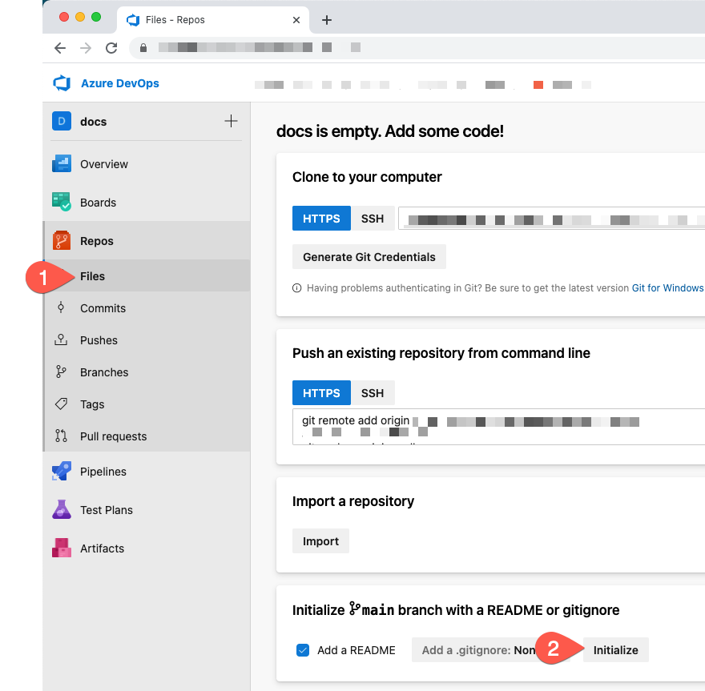
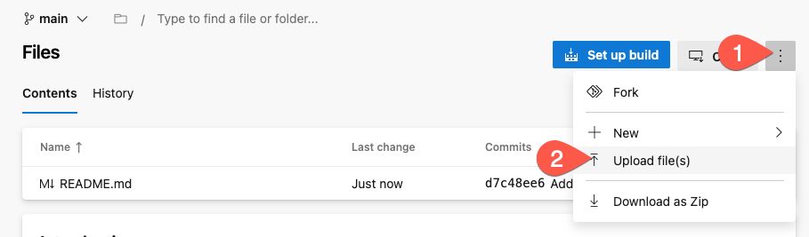
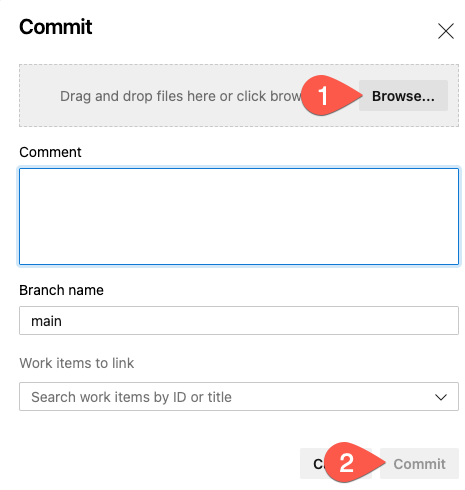

# Scanning Azure DevOps Repositories with Accurics

You can use the Accurics Console to scan an Azure DevOps repository.

## Prerequisites

* An Accurics user account with an Operator or greater role
* An Azure subscription with enough permissions to create a resource and network security group
* A Azure DevOps organization with an empty project that you have `basic` access to

## Step 1: Initializing an Azure DevOps Repository

If you haven't used Azure DevOps Repositories before, the easiest way to intialize a repository is with a README file:

1. Initialize the repository by going to **Repos**, **Files** and then clicking the **Intialize** button

    


## Step 2: Adding IaC to your repository

Now it's time to upload the following IaC to your Azure DevOps repository:

```terraform
--8<-- "docs/assets/iac/azure/broken/azure_example_broken.tf"
```

### Not familiar with git?

1. Click the three vertical dots on the right side of the page and select **Upload File(s)**

    

2. Click **Browse...**, find the file that you saved from above, and click **Commit**

    


## Step 2: Add an environment to the Accurics Console

TODO


## Step 3: Scan the source code

TODO

## Step 4: Reviewing the results

TODO