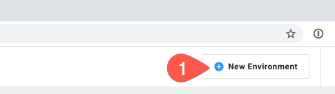
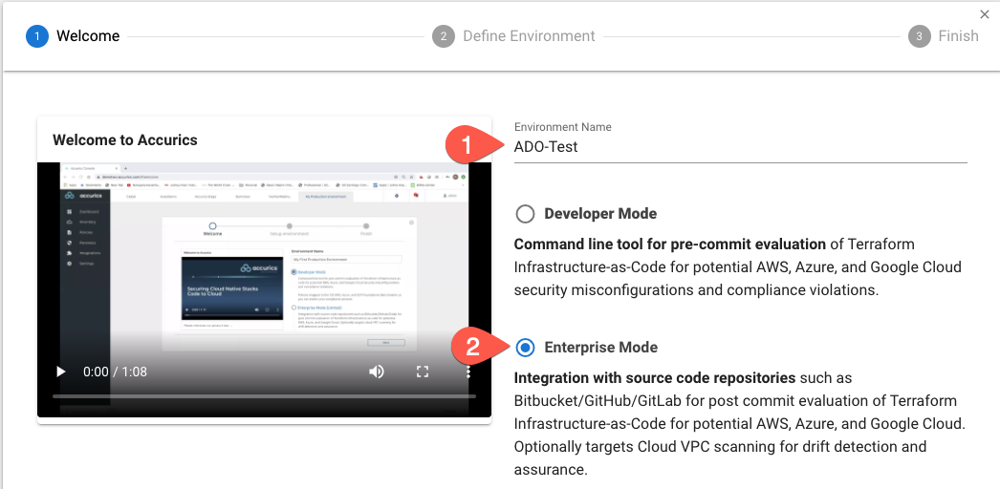
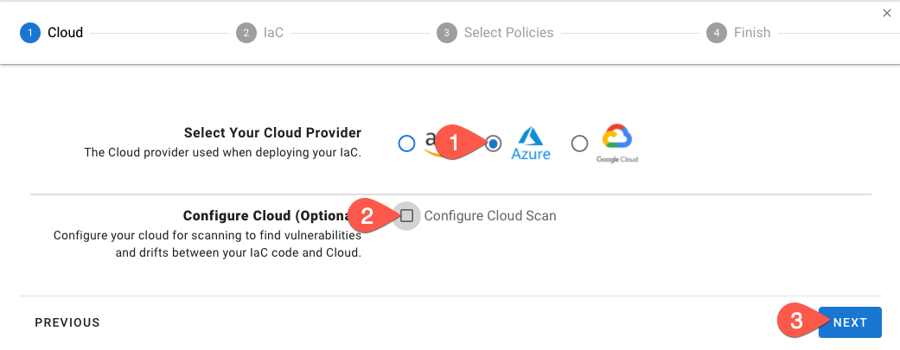
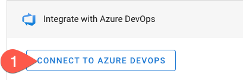
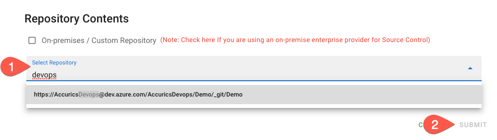
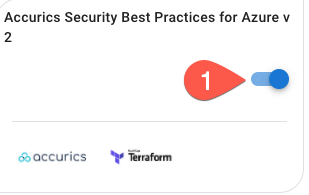
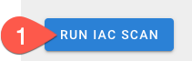
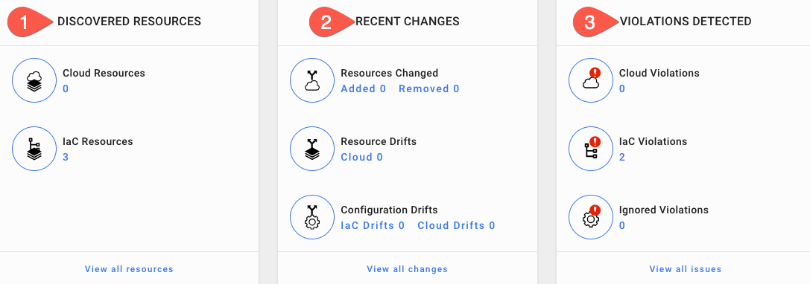
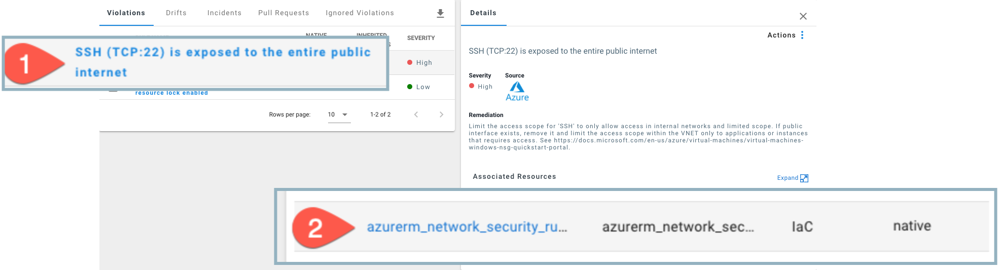

# Scanning Azure DevOps Repositories with Accurics

You can use the Accurics Console to scan an Azure DevOps repository.

## Prerequisites

* An Accurics Enterprise user account with an Operator or greater role
* An Azure subscription with enough permissions to create a resource and network security group
* An Azure DevOps organization with an empty project that you have `basic` access to

## Step 1: Initializing an Azure DevOps Repository

If you haven't used Azure DevOps Repositories before, the easiest way to initialize a repository is with a README file:

1. Initialize the repository by going to **Repos**, **Files** and then clicking the **Intialize** button

    


## Step 2: Adding IaC to your repository

Now it's time to push the following IaC to your Azure DevOps repository using git.

```terraform
--8<-- "docs/assets/iac/azure/broken/azure_example_broken.tf"
```

### Not familiar with git?

1. Click the three vertical dots on the right side of the page and select **Upload File(s)**

    

2. Click **Browse...**, find the file that you saved from above, and click **Commit**

    


## Step 2: Add an environment to the Accurics Console

The next step is to add the ADO repository that you created above to the Accurics Console and scan it. One or more repositories are added to an Accurics Environment container. You can also connect an Accurics Environment to a a cloud account to compare IaC in a source code repository to a cloud runtime environment, but for the purposes of this lab, we will focus on IaC scanning.

1. Log into the [Accurics Console](https://apps.accurics.com)
2. Click on the **New Environment** button at the top right

    

3. Enter an **Environment Name**, such as "ADO-Test"

    

4. Select **Enterprise Mode**
5. Click **Next**
6. Select **Azure** and unselect **Configure Cloud Scan**

    

7. Click **Next**
8. Expand **Integrate with Azure DevOps** and click **Connect to Azure DevOps**. You may be asked to log into your account - please do so.

    

9. Under *Select your IaC Repositories* click the **Select** button
10. Select the repository you created earlier 

    !!! info
        You can type the name of the repository in the window to start a search

    

11. Click **Submit**
12. Click **Next**
13. Now we get to select the policies to be enforced. For this lab, let's select **Accurics Security Best Practices for Azure v2**

    

    !!! info
        The Accurics platform has over 1800 policies at the time of writing this lab, ranging from CIS Benchmarks to HIPAA and GDPR. We also have an in-house security research team that is always writing new policies to detect the latest in cloud security issues.
        
        That's not all though! You can write your own policies using the [Rego Policy Language](https://www.openpolicyagent.org/docs/latest/policy-language/)

14. Click **Next**
15. Click **Finish**

## Step 3: Scan the source code

The next step is to scan the IaC source code repository. To do so, simply click the *Run IAC Scan* button at the top right. After a short while, results will be populated on the dashboard screen.



## Step 4: Reviewing the results

Finally, let's review the results. You'll notice that after you run an IaC scan that the dashboard now has information populated in it:



### Discovered Resources

The *Discovered Resources* section displays the number of discovered resources in both your IaC and Cloud. In this case, because we are only performing IaC scanning, we only show the 3 IaC resources that we found in the Terraform that you committed to Azure DevOps above.

If Cloud Scan were enabled, the numbers would be equal in an ideal world, but if not all of your cloud runtime is deployed via IaC you would have more resources deployed in the cloud than in your IaC.

!!! info
    A resource is a single cloud/IaC element, such as instance, security group, IP address, database, etc.

### Recent Changes

The *Recent Changes* section displays the amount of resources added or removed in the environment, the number of resource drifts between IaC and the cloud, and configuration drifts in IaC and the cloud runtime environment. In this lab, these will all be 0, because there is no cloud and no changes have been made in the IaC.

This section is particularly useful to quickly spot how many resources changed since the last scan and to show how many drifts you have to help ascertain where changes are being made. An example would be if there were cloud drifts that were not reflected in IaC, that would signal that someone is making modifications in cloud runtime without pushing those changes to IaC - not great!

### Violations Detected

Finally, the *Violations Detected* section displays the number of policy violations in cloud/IaC and how many of them are ignored.

The code above has two individual violations, so the number two (2) is displayed under *IaC Violations*. If you click the **View all issues** link at the bottom, you can see a list of violations and the severity of the issue.

Click on *SSH (TCP:22) is exposed to the entire public internet* and a pane will pop up that gives you more information, including remediation steps and a link to additional information. 



## Extra Credit

Fix the SSH violation, rescan the repo, and watch the violation go away!