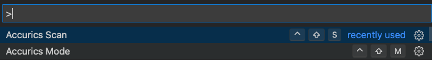
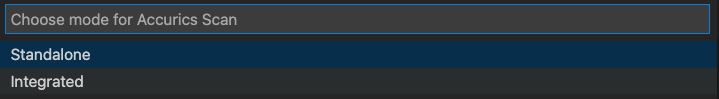
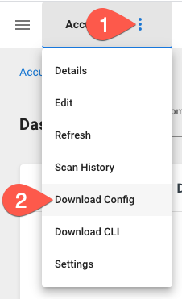

# Running the Accurics VS Code Extension

The Accurics VS Code Extension can be run inside of Microsoft VS Code either through a right click action on a file, or the quick launcher.

## Prerequisites

* [Microsoft VS Code](https://code.visualstudio.com/)
* [Microsoft VS Code Terraform extension](https://marketplace.visualstudio.com/items?itemName=HashiCorp.terraform)
* Terraform version >= .12
* For Integrated mode scans, an Accurics user account with an Operator or greater role
* For Integrated mode scans, an Azure subscription with enough permissions to create a resource and network security group
* For Integrated mode scans, an environment on the Accurics Console to scan your IAC repository that you will be using to create the CI/CD builds

## Installation

The first step is to install the Accurics VS Code extension. You can either install it directly from inside VS Code Extension Marketplace itself, or by following [this link to the extension documentation](https://marketplace.visualstudio.com/items?itemName=AccuricsInc.accurics-iac) and clicking **Install** on the page.

!!! note
    You must have the [Microsoft VS Code Terraform extension](https://marketplace.visualstudio.com/items?itemName=HashiCorp.terraform) for the extension to properly work.

## Modes

The Accurics extension has two modes of operation: *Standalone* and *Integrated*. 

* Standalone mode does not require an Accurics account. Any violations will be printed to the console.
* Integrated mode requires a configuration file and an Accurics account. Violations will be uploaded to the Accurics console and to the local directory in JSON/HTML format.

To select the mode, you can use the Command Palette. The keyboard shortcut for this differs per platform and you can find reference guides on [Microsoft's website](https://code.visualstudio.com/docs/getstarted/keybindings#_keyboard-shortcuts-reference).

For macOS, the default key bind is ++command+shift+p++

1. Once in the Command Palette, you can enter **Accurics** and **Accurics Mode** will be an option. Select it or hit ++enter++

    

2. Select the mode or hit ++enter++

    

## Standalone

A standalone scan doesn't require an Accurics account and can be run by either right clicking an IaC file, or by using the Command Palette in Microsoft VS Code and selecting **Accurics Scan**.

## Integrated

With inteagrated mode, violations will be uploaded to the Accurics console and to the local directory in JSON/HTML format. It also uses policies set in the console.

### Step 1: Download configuration file

Depending on your organization, you may already have a copy of your Accurics configuration file. If one hasn't been supplied to you, it can be downloaded from the Accurics Console.

1. Log into the Accurics console
2. Click the three vertical dots to open the menu for your environment
3. Click **Download Config**

    

4. Save the file to your computer to a folder of your choosing.

### Step 2: Run `Accurics Configuration`

You will need to configure the Accurics extension to use the previously downloaded configuration. To do so:

1. Enter the VS Code Command Palette and open `Accurics Configuration`
2. Navigate to the downloaded configuration file and double click the file

### Step 3: Scanning IaC

The final step is scanning the IaC. This is done in two stages, first with a one time `accurics init` and then an `accurics scan`. The workflow is similar to running Accurics directly from the CLI.

#### Step 3.1: `accurics init`

`accurics init` is a wrapper around `terraform init` that downloads all the required Terraform providers, and is required prior to running any futher commands.

To run an init, right click a file and select `Accurics Scan` -> `Init`

```
Running Accurics init...
init Complete.
2021/03/21 18:49:25 Starting accurics cli
2021/03/21 18:49:25 CliVersion: 1.0.8

Terraform version Detected 0.14.x

Initializing the backend...

Initializing provider plugins...
- Reusing previous version of hashicorp/azurerm from the dependency lock file
- Using previously-installed hashicorp/azurerm v2.51.0

Terraform has been successfully initialized!

You may now begin working with Terraform. Try running "terraform plan" to see
any changes that are required for your infrastructure. All Terraform commands
should now work.

If you ever set or change modules or backend configuration for Terraform,
rerun this command to reinitialize your working directory. If you forget, other
commands will detect it and remind you to do so if necessary.
```

#### Step 3.2: `accurics plan`

After initalizing the IaC, you must run `accurics plan`, which is a wrapper around `terraform plan` that:

1. Runs a `terraform plan`
2. Runs an analysis that compares the Terraform code to the resources that Terraform will create
3. Generates a dependency graph
4. Outputs JSON and HTML files listing any violations
5. Gives you a summary of how many resources are in the Terraform code, and number of violations sorted by severity
6. Uploads the results to the Accurics Console so they can be viewed online

To run a plan, right click a file and select `Accurics Scan` -> `Plan`

```
Running Accurics plan...
plan Complete.
2021/03/21 18:54:37 Starting accurics cli
2021/03/21 18:54:37 CliVersion: 1.0.8
2021/03/21 18:54:38 runPlan...
2021/03/21 18:54:38 [plan -out=1616370878078.out]
2021/03/21 18:55:00 Running Accurics analysis...
2021/03/21 18:55:00 mapping terraform resources to source code...
2021/03/21 18:55:00 Repo Root Path... [snipped]/iac/azure/broken
2021/03/21 18:55:00 Current working directory ... [snipped]/iac/azure/broken
2021/03/21 18:55:00 getting source code for all the resources present in '[snipped]/iac/azure/broken'
2021/03/21 18:55:00 resources to source code mapping done!
2021/03/21 18:55:00 Creating dependency graph...
2021/03/21 18:55:00 GetDotFileUsingGraph Directory: [snipped]/iac/azure/broken
2021/03/21 18:55:00 Using configuration file:-  [snipped]/config

Terraform version Detected 0.14.x
....................................................................................


[snipped]
----------------------------------------------------------------------------------------------------------------

Accurics successfully scanned the repository! Following is the summary - for details visit Accurics Web Console.

{
  "resources": 3,
  "violation": 2,
  "low": 1,
  "medium": 0,
  "high": 1,
  "native": 2,
  "inherit": 0,
  "drift": 0,
  "iacdrift": 0,
  "clouddrift": 0
}

----------------------------------------------------------------------------------------------------------------


{
  "scanId": "[snipped]",
  "envId": "[snipped]",
  "envName": "Accurics CLI",
  "summary": {
    "resources": 3,
    "violation": 2,
    "low": 1,
    "medium": 0,
    "high": 1,
    "native": 2,
    "inherit": 0,
    "drift": 0,
    "iacdrift": 0,
    "clouddrift": 0
  },
  "enforcingModeSummary": {
    "violation": 0,
    "low": 0,
    "medium": 0,
    "high": 0
  },
  "violations": [
    {
      "type": "azurerm_network_security_rule",
      "id": "azurerm_network_security_rule.ssh",
      "name": "ssh",
      "source": "Accurics CLI/azure_example_broken.tf",
      "rule": "networkPort22ExposedPublicEntire_1000",
      "vulnerability": "SSH (TCP:22) is exposed to the entire public internet",
      "remediation": "Limit the access scope for 'SSH' to only allow access in internal networks and limited scope. If public interface exists, remove it and limit the access scope within the VNET only to applications or instances that requires access. See https://docs.microsoft.com/en-us/azure/virtual-machines/virtual-machines-windows-nsg-quickstart-portal.",
      "severity": "HIGH",
      "inference": "native",
      "policyName": "Accurics Security Best Practices for Azure v2",
      "ruleDisplayName": "SSH (TCP:22) is exposed to the entire public internet",
      "policyMode": "Regular"
    }, 
    {
      "type": "azurerm_resource_group",
      "id": "azurerm_resource_group.rg",
      "name": "rg",
      "source": "Accurics CLI/azure_example_broken.tf",
      "rule": "resourceGroupLock_1000",
      "vulnerability": "Ensure that Azure Resource Group has resource lock enabled",
      "remediation": "Resource Manager Locks allow administrators to lock down Azure resources and prevent deletion or changing of resources. You can set the lock level to CanNotDelete or ReadOnly. In the portal, the locks are called Delete and Read-only respectively. It is recommended to have locks enabled to prevent accidental or malicious change or deletion.",
      "severity": "LOW",
      "inference": "native",
      "policyName": "Accurics Security Best Practices for Azure v2",
      "ruleDisplayName": "Ensure that Azure Resource Group has resource lock enabled",
      "policyMode": "Regular"
    }
  ],
  "HasErrors": false
}
```

### Step 4: Viewing results
The Accurics extension outputs results in a few ways.

1. In the Accurics Console
2. To `stdout` in the VS Code Output pane
3. A JSON blob in the directory you ran the Accurics CLI from
4. An HTML file that is also in the directory you ran the Accurics CLI from
